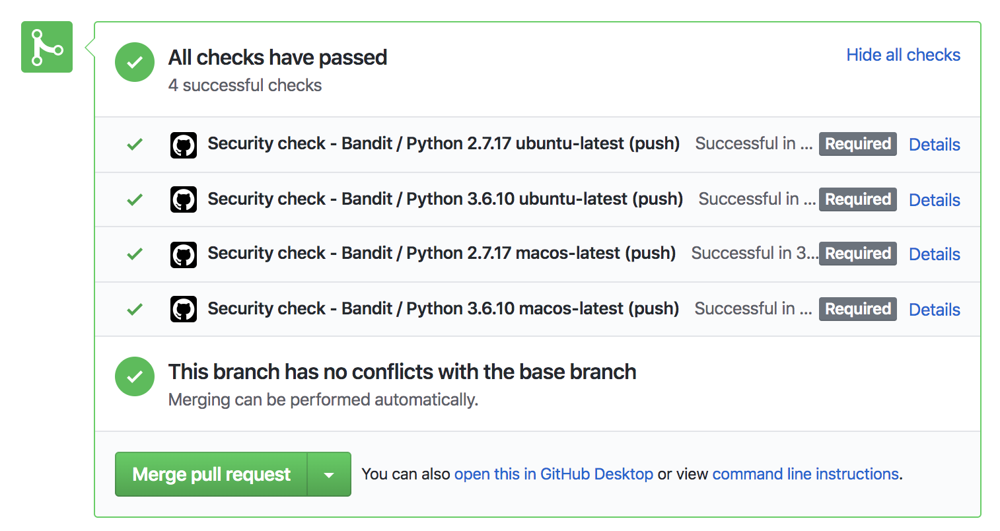
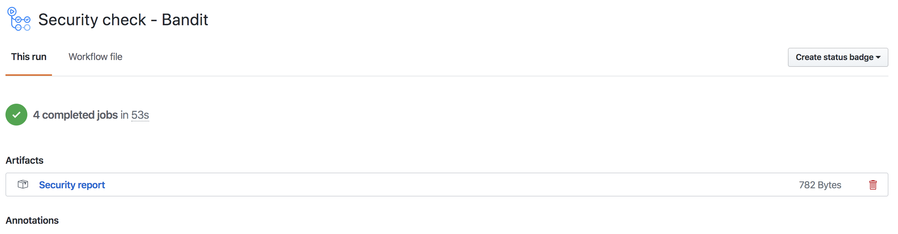

<p align="center">
  <a href="https://github.com/marketplace/actions/bandit-report-artifacts">
    
  </a>
</p>

<h1 align="center">
  Github action which can make security check reports after the running bandit as artifacts.
</h1>

<p align="center">
  This <a href="https://github.com/features/actions">GitHub Action</a> runs
   bandit checks on your code and annotates the interested lines with the
    issues.
</p>

<p align="center">
  
</p>
<p align="center">
  
</p>

## Usage

```yml
name: Security check - Bandit

on: push

jobs:
  build:
    runs-on: ubuntu-latest
    strategy:
      matrix:
        os: [ ubuntu-latest, macos-latest ]
    name: Python ${{ matrix.os }} 

    steps:
    - uses: actions/checkout@v2

    - name: Security check - Bandit
      uses: ./
      with:
        python_version: ${{ matrix.python-version }}
        project_path: .
        ignore_failure: true

    - name: Security check report artifacts
      uses: actions/upload-artifact@v1
      # if: failure()
      with:
        name: Security report
        path: output/security_report.txt
```


### Getting Started :airplane:

You can include the action in your workflow to trigger on any event that
 [GitHub actions supports](https://help.github.com/en/articles/events-that-trigger-workflows). 
 If the remote branch that you wish to deploy to doesn't already exist the action will create it for you. 
 Your workflow will also need to include the `actions/checkout` step before this workflow runs 
 in order for the deployment to work.


If you'd like to make it so the workflow only triggers on push events
 to specific branches then you can modify the `on` section.

```yml
on:
  push:
    branches:
      - master
```

### Configuration 📁

The `with` portion of the workflow **must** be configured before the action will work.
 You can add these in the `with` section found in the examples above. 
 Any `secrets` must be referenced using the bracket syntax and stored 
 in the GitHub repositories `Settings/Secrets` menu. 
 You can learn more about setting environment variables 
 with GitHub actions [here](https://help.github.com/en/articles/workflow-syntax-for-github-actions#jobsjob_idstepsenv).

#### Required Setup

One of the following deployment options must be configured.

| Key                | Value Information                                                                                                                                                                                                                                                                                                                                     | Type   | Required | Default |
| ------------------ | ----------------------------------------------------------------------------------------------------------------------------------------------------------------------------------------------------------------------------------------------------------------------------------------------------------------------------------------------------- | ------ | -------- | -------- |
| `PROJECT_PATH` | To provide you python location at which this security check needed to be done.                                                                                                 | `with` | **No**  | "." |
| `IGNORE_FAILURE` | This is to ignore the security failures and pass the check.                                                                                                 | `with` | **No**  | false |


---


### Artifacts 📁

You can get the bandit security checks reports for you python project.
[learn more about artifacts](https://help.github.com/en/actions/configuring-and-managing-workflows/persisting-workflow-data-using-artifacts).

#### Bandit report (security checks report) 👮‍♂️

The following is an bandit report for a django project. 
[learn more about bandit](https://pypi.org/project/bandit/).

```txt
Run started:2020-03-22 18:12:42.386731

Test results:
>> Issue: [B105:hardcoded_password_string] Possible hardcoded password: '(2h1-*yec9^6xz6y920vco%zdd+!7m6j6$!gi@)3amkbduup%d'
   Severity: Low   Confidence: Medium
   Location: ./sample_project/settings.py:25
   More Info: https://bandit.readthedocs.io/en/latest/plugins/b105_hardcoded_password_string.html
24      # SECURITY WARNING: keep the secret key used in production secret!
25      SECRET_KEY = "(2h1-*yec9^6xz6y920vco%zdd+!7m6j6$!gi@)3amkbduup%d"
26
27      # SECURITY WARNING: don't run with debug turned on in production!
28      DEBUG = True

--------------------------------------------------

Test results:
	No issues identified.

Code scanned:
	Total lines of code: 138
	Total lines skipped (#nosec): 0

Run metrics:
	Total issues (by severity):
		Undefined: 0.0
		Low: 0.0
		Medium: 0.0
		High: 0.0
	Total issues (by confidence):
		Undefined: 0.0
		Low: 0.0
		Medium: 0.0
		High: 0.0
Files skipped (0):
```

This can be achieved by add the following to your job

```yml
    - name: Security check report artifacts
      uses: actions/upload-artifact@v1
      # if: failure()
      with:
        name: Security report
        path: output/security_report.txt
```

### License 👨🏻‍💻

The Dockerfile and associated scripts and documentation in this project 
are released under the [MIT License](LICENSE).

Container images built with this project include third party materials. 
As with all Docker images, these likely also contain other software which 
may be under other licenses. It is the image user's responsibility to ensure
that any use of this image complies with any relevant licenses for all
software contained within.